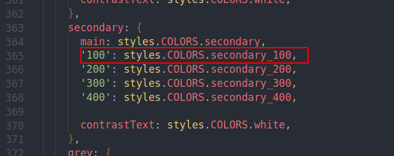
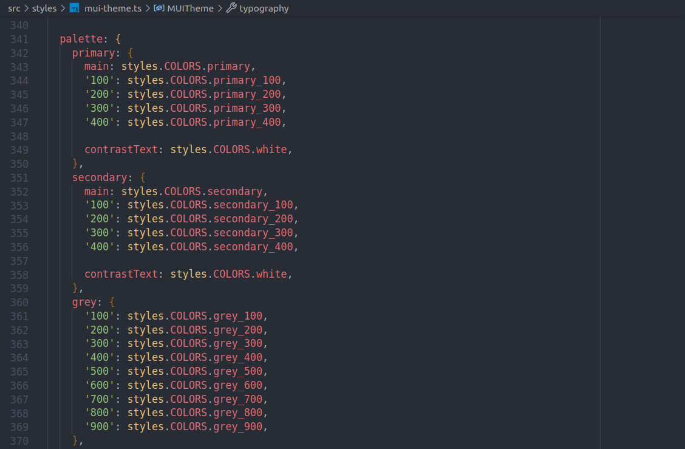

# Documentação/Code Style - Frontend

- **Configuração do VSCode**
    - Extensões
    - Configuração
- **Estrutura de pastas**
- **Componentes**
    - Tipos de componentes
    - Criação de componentes
- **Estilização**
    - Componentes MUI
    - Componentes criados
- **Cores e Sombras**
    - Paleta de cores
    - Variações de cores com polished
    - Sombras
- **Redux**
    - Store
    - Slices
    - Thunks
- **Tratamento de erros de requisições**
- **Guia principais Componentes**
    - Grid
    - Flex
    - Textos
    - Inputs
    - Botões
- **Possíveis de problemas**
    - Projeto não carregar no chrome.

## 🔧 **Configuração do VSCode**

### ◾**Extensões:**

- [EditorConfig](https://marketplace.visualstudio.com/items?itemName=EditorConfig.EditorConfig)
- [ESLint](https://marketplace.visualstudio.com/items?itemName=dbaeumer.vscode-eslint)
- [GitGraph](https://marketplace.visualstudio.com/items?itemName=mhutchie.git-graph)
- [GitFlow](https://marketplace.visualstudio.com/items?itemName=vector-of-bool.gitflow)
- [MaterialIcon](https://marketplace.visualstudio.com/items?itemName=PKief.material-icon-theme)
- [SonarLint](https://marketplace.visualstudio.com/items?itemName=SonarSource.sonarlint-vscode)

### ◾**Configuração:**

Adicione as seguintes configurações ao seu settings.json.

```jsx
{
  "git.mergeEditor": false,
  "explorer.compactFolders": false,

  "window.zoomLevel": 1,
  "editor.quickSuggestions": {
    "other": false,
    "comments": false,
    "strings": false
  },
  "editor.wordWrap": "on",
  "editor.tabSize": 2,
  "editor.autoIndent": "full",
  "editor.rulers": [
    90,
    120
  ],
  "diffEditor.ignoreTrimWhitespace": false,
  "workbench.startupEditor": "newUntitledFile",

  "[javascript]": {
    "editor.codeActionsOnSave": {
      "source.fixAll.eslint": true
    }
  },
  "[typescript]": {
    "editor.codeActionsOnSave": {
      "source.fixAll.eslint": true
    }
  },
  "[typescriptreact]": {
    "editor.codeActionsOnSave": {
      "source.fixAll.eslint": true
    }
  },

  "javascript.updateImportsOnFileMove.enabled": "always",
  "typescript.updateImportsOnFileMove.enabled": "always",
  "npm.keybindingsChangedWarningShown": true,
}
```

## 📁 **Estrutura de pastas**

O projeto possui a seguinte estrutura de pastas:

- **Src:**
    - **@types**: configurações de tipagens gerais do typescript.
    - **assets**: ícones e imagens.
    - **components**: componentes genéricos, de uso geral na aplicação.
    - ********hooks********: hooks de uso geral na aplicação.
    - **interfaces**: interfaces e enums de uso geral, devem ser criadas usando o prefixo “I”.
    - **pages**: páginas do sistema.
    - **permissions**: enums de permissões por módulos do sistema.
    - **providers**: centralização dos providers de libs e de hooks.
    - **redux**: configuração da store e slices do redux.
        - **features**: slices e thunks.
    - **routes**: configuração das rotas do sistema.
    - **services**: configuração da api axios.
    - **storage**: arquivos para facilitar e padronizar armazenamento de dados no localstorage.
    - **styles**: estilização global, cores e configurações do mui.
    - **utils**: centralizador de funções de uso geral.
    - **validators**: schemas de validação de formulários yup.

## ⚛️ **Componentes**

### ◾**Tipos de componentes:**

- **Componentes de uso geral**: esses temos os que ficam na pasta: `src > components` e são componentes mais genéricos que podem ser usados em mais de um módulo e também os da lib **mui**.
- **Componentes por módulo:** esses são de usos mais específicos e ficam dentro das pastas `src > pages > nomeDoModulo > components`, devemos manter apenas uma pasta **components** por módulo. Esses componentes são usados somente no módulo onde foram criados.
- **Subcomponentes**: nos casos onde é necessário criar subcomponentes para facilitar o desenvolvimento, e esses componentes serão usados somente para constituir parte do componente pai, esses devem ser criados dentro da pasta do componente atual.

### ◾**Criação de componentes**:

Durante a criação de novos componentes devemos seguir as seguintes **regras**:

- Manter apenas um componente por arquivo.
- Componentes devem ser criados usando funções (`function`).
- Funções criadas dentro de componentes devem ser em `arrow function`.
- Deve ser criado um tipo (`type`) definindo as props que o componente precisa.
- Evitar criar componentes que possuam mais de 300 linhas, caso isso ocorra refatorar o código dividindo em subcomponentes.

## 💅🏻 Estilização

- Sempre usar **REM** em vez de **PX**, usar a seguinte ferramente para fazer a conversão: [https://nekocalc.com/px-to-rem-converter](https://nekocalc.com/px-to-rem-converter).

### ◾Componentes MUI

- Quando for necessário estilizar os componentes **mui** vamos inicialmente usar props diretas para definir esse estilo (**não usar prop sx ou styles**).

    Ex:

    ```jsx
    <Box p="1rem" mt="2rem" bgcolor="grey">
    	...
    </Box>
    ```

## 🎨 C**ores**

### ◾Paleta de cores

- Sempre que formos usar uma cor devemos importar a paleta de cores no arquivo: `src/styles/index.ts`.
- Nunca usar cores que não existam na paleta de cores.
- No caso de componentes do **mui** passamos o nome da cor como está no arquivo: `src/styles/mui-theme.ts` diretamente na prop **color**.

    

    ```jsx
    <Typography color="secondary.100">
    	Texto
    </Typography>
    ```


### ◾Variação de cores com polished

- Quando for necessário variar alguma propriedade das cores, devemos usar as funções da [biblioteca polished](https://polished.js.org/docs/).

    ```jsx
    import { rgba } from 'polished';
    import styles from 'src/styles';

    rgba(styles.COLORS.grey_500, 0.48); // Altera a opacidade para 48%
    ```


### ◾Sombras

- Todos os tipos de sombra já estão definidas dentro do arquivo: `src/styles/index.ts` conforme o design do projeto. Nunca definir sombras em outros arquivos.

## ⚛️ **Redux**

- Devemos usar o redux para lidar com estados mais complexos e para criação de estados de dados retornados por requisições.

### ◾**Thunks**

- Devem ser criados dentro no diretório: `src/redux/features`.
- São usados para lidar com **ações assíncronas**, devemos usá-los para as requisições.
- Devem ter o seguinte formato:

```jsx
import { createAsyncThunk } from '@reduxjs/toolkit';
import axios from 'axios';

type LoginParams = {
  email: string;
  password: string;

  cb: (user: ISessionUser) => void;
};

export const login = createAsyncThunk(
  'session/login',
  async ({ email, password, cb }: LoginParams, { dispatch }) => {
    try {
      const { data } =
        await api.backendPublic.post('/login', {
          login: email,
          password,
        });

      cb(data.user);

      return data;
    } catch (error: any) {
      handleRequestError(error, dispatch);
    }
  },
);
```

### ◾**Slices**

- Devem ser criados dentro no diretório: `src/redux/features`.
- Separa o estado do redux por fatias (slices), facilitando o uso.
- Todos os loadings de thunks dentro de slice devem possuir o seguinte tipo: `'idle' | 'pending' | 'succeeded' | 'failed'` definido na interface **IThunkLoading**.
- Slices devem ter o seguinte formato:

```jsx
import { createSlice } from '@reduxjs/toolkit';
import { login } from './thunks';
import { ICompany, ISessionUser, IThunkLoading } from 'src/interfaces';

type InitialState = {
  user: ISessionUser | null;
  company: ICompany | null;

  loginLoading: IThunkLoading;
};

const initialState = {
  user: null,
  company: null,

  loginLoading: 'idle',
} as InitialState;

export const sessionSlice = createSlice({
  name: 'session',
  initialState,
  reducers: {
    signOut(state) {
      return { ...initialState, user: null, company: null };
    },
    setSessionCompany(state, { payload }) {
      authStorage.setCompany(payload);
      state.company = payload;
    },
  },
  extraReducers: (builder) => {
    builder
      .addCase(login.pending, (state) => {
        state.loginLoading = 'pending';
      })
      .addCase(login.fulfilled, (state, { payload }) => {
        const { user } = payload!;

        state.user = user;
        state.loginLoading = 'succeeded';
      })
      .addCase(login.rejected, (state) => {
        state.loginLoading = 'failed';
      });
  },
});

export const { signOut, setSessionCompany } = sessionSlice.actions;

export * from './thunks';
```

- **Thunks** devem ser adicionados em `extraReducers`.
- **Reducers** que não precisam consumir rotas da api devem ser criados no parâmetro `reducers`.

### ◾**Store**

- Fica no diretório: `src/redux`.
- Centraliza todas as slices.

```jsx
import { configureStore } from '@reduxjs/toolkit';
import { sessionSlice } from './features';

export const store = configureStore({
  reducer: {
    session: sessionSlice.reducer,
  },
});
```

## 🚨 **Tratamento de erros de requisições**

- Erros de requisições devem sempre mostrar a mensagem retornada pelo backend.
- Para tratar esses erros temos a função `handleRequestError` no diretório: `src/utils/request.ts`. Devemos usá-la em todos os thunks.

    ```jsx
    export const getPermissions = createAsyncThunk(
      'session/permissions',
      async (_, { dispatch }) => {
        try {
          const { data } = await api.backend.get('/profiles/permissions');
          return data;

        } catch (error: any) {
          handleRequestError(error, dispatch);
        }
      },
    );
    ```

## 🦮 **Guia de uso - principais Componentes**

### ◾**Grid:**

- Para criação de layouts grid devemos usar o componente `Grid` do **mui**,
- Deve ser passado a prop **container** no componente pai, e a prop **item** nos componentes filhos.
- Para definir quanto espaço cada componente filho irá ocupar passamos a prop **xs** com um valor entre 1 e 12.
- Espaçamento entre componentes filhos pode ser feito usando a prop `spacing`.

```jsx
import Grid from '@mui/material/Grid';

export default function BasicGrid() {
  return (
    <Grid container spacing={2}>
      <Grid item xs={8}>
				xs=8
      </Grid>
      <Grid item xs={4}>
        xs=4
      </Grid>
      <Grid item xs={4}>
        xs=4
      </Grid>
      <Grid item xs={8}>
        xs=8
      </Grid>
    </Grid>
  );
}
```

Para mais informações acessar a [documentação do Grid do mui](https://mui.com/material-ui/react-grid/).

### ◾**Flex:**

- Para criação de layouts flex devemos usar o componente `Stack` do **mui.**
- Nele temos a **props** `direction` para definir se será uma coluna ou uma linha (por padrão é definido como coluna).

```jsx
import { IconButton, Stack, Tooltip } from '@mui/material';

export function CompanyItemActions() {
  return (
    <Stack direction="row" justifyContent="flex-end" alignItems="center">
      <IconButton />

      <IconButton />
    </Stack>
  );
}
```

- Para alterar a `direction` conforme o tamanho da tela podemos fazer da seguinte forma:

```jsx
<Stack direction={{ md: 'row', xs: 'column' }}>
```

Para mais informações acessar a [documentação do Stack do mui](https://mui.com/material-ui/react-stack/).

### ◾**Textos:**

- Todos os textos devem usar o componente `Typography` do **mui**.
- Para definir o **tipo** do texto (body1, subtitle1, h1, h2, etc..) usamos a prop `variant`.

```jsx
<Typography variant="h6">
	Texto
</Typography>

<Typography variant="subtitle2">
	Texto
</Typography>

<Typography variant="body2">
	Texto
</Typography>
```

- As cores devem ser passadas com a prop **color** e deve ser conforme o nome da cor definido na paleta de cores no arquivo: `src > styles > mui-theme.ts`



```jsx

<Typography color="primary">
	Texto
</Typography>

<Typography color="secondary.100">
	Texto
</Typography>

<Typography color="grey.700">
	Texto
</Typography>
```

- Demais propriedades devemos passar diretamente, no caso de espaçamento usar sempre **REM**:

```jsx
<Typography fontWeight="bold" padding="1rem" mt="1rem">
	Texto
</Typography>
```

Para mais informações acessar a [documentação do Typography do mui.](https://mui.com/material-ui/react-typography/)

### ◾**Inputs:**

- Todos os inputs devem usar o componente `TextField` ou semelhantes do **mui**.
- Devemos passar a prop `fullWidth` para preencher horizontalmente.

```jsx
<TextField
	fullWidth
	variant="outlined"
	label="Nome completo"
	type="text"
/>
```

Para mais informações acessar a [documentação do TextField do mui](https://mui.com/material-ui/react-text-field/)[.](https://mui.com/material-ui/react-typography/)

- Para inputs que precisam de máscara devemos usar o componente `MaskedTextField` da pasta `src/components`.

```jsx
<MaskedTextField
  fullWidth
  variant="outlined"
  type="text"
  label="Telefone"
  mask="(99)99999-9999"
/>
```

### ◾**Botões:**

- Os botões devem usar o componente `Button` do **mui**.

```jsx
<Button variant="contained" type="submit" color="inherit" size="medium">
	Salvar
</Button>
```

- Para variar o tamanho do botão usar a prop **size** que pode receber os seguintes valores: `small, medium, large`.
- Temos as seguintes variações de cores para botões, elas já estão alinhadas conforme a paleta de cores:


- Caso seja necessário um botão com **loading**, devemos usar o componente `LoadingButton` da pasta `src/components`.

```jsx
<LoadingButton
  loading={loading}
  fullWidth
  variant="contained"
  type="submit"
  color="inherit"
>
  Entrar
</LoadingButton>
```

Para mais informações acessar a [documentação do Button do mui.](https://mui.com/material-ui/react-button/)

---

## ⚠️ **Possíveis de problemas**

### ◾Projeto não carregar no Chrome:

Em alguns sistemas operacionais isso pode ocorrer, devido à quantidade de arquivos do projeto em conjunto do Chrome pedir mais informações sobre arquivos enviados e acabar chegando no limite que o sistema tem por padrão.

- **Resolução**:

Para resolver esse problema basta alterar o limite do sistema, no ubunto e mint podemos alterar da seguinte forma:

1. Primeiro vamos acessar o arquivo `limits.conf`:

```jsx
sudo nano /etc/security/limits.conf
```

2. E então adicionar essa linha:

```jsx
* - nofile 65536
```

3. Após isso será necessário reiniciar a máquina para pegar as alterações.
